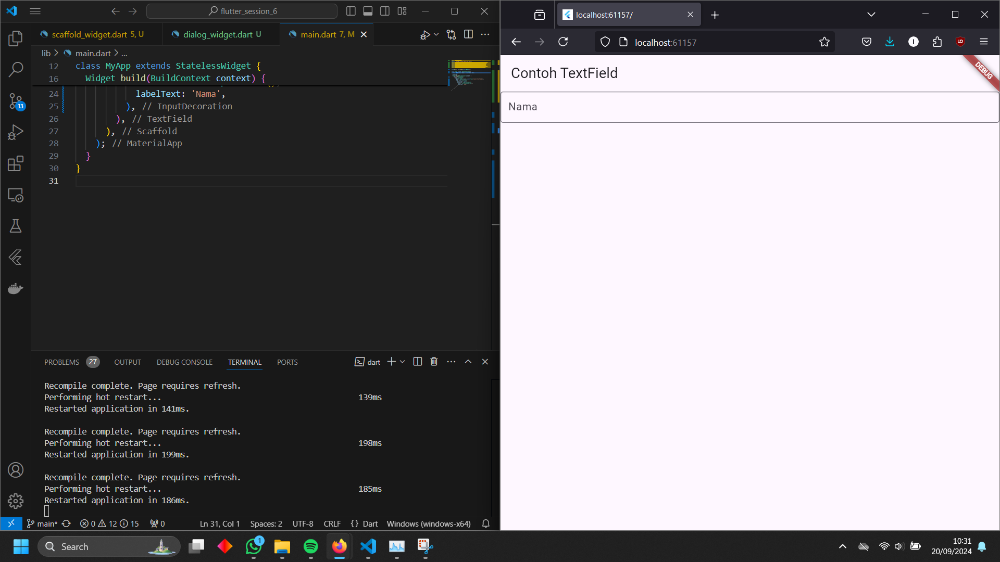

Link Repository Praktikum : https://github.com/rickytedjo/flutter-fundamental-part1

# Praktikum 1
## Langkah 1

## Langkah 2

## Langkah 3

## Langkah 4

# Praktikum 2
## Langkah 1

## Langkah 2

## Langkah 3

## Langkah 4

## Langkah 5

## Langkah 6

## Langkah 7

## Langkah 8

## Langkah 9

## Langkah 10

## Langkah 11

## Langkah 12

# Praktikum 3
## Langkah 1

## Langkah 2

# Praktikum 4
## Langkah 1

## Langkah 2

## Langkah 3

## Langkah 4

## Langkah 5

## Langkah 6

# Tugas Praktikum 2

Widget-widget praktikum 4 dimasukkan kedalam scaffoldpage

